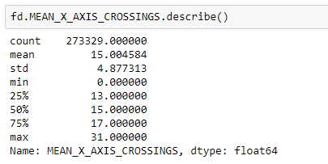

# ANALISIS DE DATOS SISMOGRÁFICOS PROCEDENTES DE LA MISIÓN VIKING


### INTRODUCCIÓN

El propósito clave de nuestro proyecto es un clasificador a tiempo real de datos procedentes de un rover u otra sonda espacial.
Esto se logrará con un cliente TCP(sonda que toma muestras)y un servidor TCP(el que se encargará de recibir los datos y clasificarlos en tiempo real). 

Para todo ello dispondremos el proyectos en diferentes fases.
* La **fase 1** del proyecto será la **fase analítica de los datos**. Se estudiará:
	- Como se distribuyen los datos en los diferentes archivos.
	- Que tipo de datos disponemos.
	- Qué características tienen esos datos, haciendo uso de estadísticas básicas y distribuciones.
	- Estandarización o normalización de los datos.
	- Estudio de correlaciones lineales e introducción en correlaciones no lineales.
	- Librerías usará cada parte.
* La **fase 2** del proyecto será la **preparación de la entrada** del clasificador y su **entrenamiento**.
	- Subdivisión del dataframe en grupos linealmente independientes.
	- Aplicación de algorítmo PCA.
	- Qué algoritmo de clasificación usar y su por qué.
	- Estudio de los datos de salida del algoritmo de clasificación.
	- Como exportar el modelo para su uso posterior
* La **fase 3** del proyecto será preparar el cliente y el servidor:
	* Cliente:
		- Como establecer la conexión.
		- Como preparar los datos simulados para envíar.
	* Servidor:
		- Como establecer la conexión
		- Como importar el modelo
		- Como tratar la entrada de datos
		- Como categorizar en tiempo de flujo real
	
		

## INDICE

- [ 1 FASE DE ANÁLISIS](#1-fase-de-análisis).
  - [1.1) PROCEDENCIA DE LOS DATOS](#insertar-hn).
  - [1.2) ESTRUCTURACIÓN DE LOS DATOS Y ESTADÍSTICAS](#insertar-hn).
    - [1.2.1) ESTRUCTURA DE LOS ARCHIVOS](#insertar-hn).
    - [1.2.2) ESTRUCTURA DE LOS DATOS](#insertar-hn).
    - [1.2.3) LECTURA DEL DATASET](#insertar-hn).
    - [1.2.4) ESTADÍSTICAS BASÍCAS DE VARIABLES A ANALIZAR](#insertar-hn).
  - [1.3) AGRUPACIÓN DE DATOS](#insertar-hn)
    - [1.3.1) NORMALIZACIÓN DEL DATASET](#insertar-hn).
    - [1.3.2) MATRIZ DE CORRELACIÓN](#insertar-hn).
    - [1.3.3) ANÁLISIS DE RELACIONES LINEALES](#insertar-hn).
    - [1.3.4) AGRUPACIÓN DE VARIABLES COMO GRUPOS INDEPENDIENTES](#insertar-hn).
  - [1.4) VARIABLES NO RELACIONADAS LINEALMENTE](#insertar-hn)
   					          
... COMPLETAR MUAJAJAJAJA NO , TENGO MIEDO, AYUDA U.Us
  
  
  ##
  ## 1 FASE DE ANÁLISIS
  ### 1.1) PROCEDENCIA DE LOS DATOS
  
  El programa Viking fue una de las misiones más ambiciosas lograda por EEUU.
  Dicho programa constaba de dos sondas, cada una de ellas formada por un orbitador y un módulo de aterrizaje. Ambas eran exactamente iguales, por ello que se las denominaran sondas gemelas.

  Para tratar sobre ellas, siempre que se muestren datos en parejas, la primera se referirá a Viking 1 y la siguiente a Viking 2.
  Los aterrizadores lograron aterrizar en lugares diferentes, una lo logró en agosto de 1975 y la siguiente en septiembre del año 1975 también.
  Su misión principal era lograr fotografías del terreno, obtener datos básicos que sirvieran para recopilar información y un conjunto de 3 experimentos biológicos.

  Todo estaba planeado para lograr recopilar datos suficientes a lo largo de 90 días tras el aterrizaje. 
  Al final, los orbitadores lograron transmitir datos hacia el planeta Tierra , una hasta el año 1980 y la otra hasta el 1978.
  Referente a los módulos de aterrizaje, la Viking 1 retransmitió datos a la Tierra hasta el año 1980, y la Viking 2 hasta el 1982.
  
  ### 1.2) ESTRUCTURACIÓN DE LOS DATOS Y ESTADÍSTICAS
  
  Todos los datos recopilados del proyecto Viking están en un servidor público perteneciente a la universidad de Washington y dados por  la NASA.
  El enlace que usaremos para descargar los archivos es:
  
  https://pds-geosciences.wustl.edu/missions/vlander/seismic.html.
  
   #### 1.2.1) ESTRUCTURA DE LOS ARCHIVOS
   Los archivos podremos encontrarlos en tres formatos diferentes: csv, lbl o tab.
   Los archivos csv son archivos comúnmente utilizados, separados los datos por columnas y con un separador común. En nuestro caso es la coma.
   Los archivos tab, es el otro tipo contenedor de datos, donde cada dato está separado por un número de bytes establecidos en el archivo lbl y éste cambiará según la columna y su contenido.
   El tercer tipo de archivo lbl, contendrá información sobre el documento al que referencia, que datos tiene de cada columna, en que byte empieza y en cual acaba, y el tipo de datos que contiene.
    
   ```
    	 AQUI METER UN ARCHIVO FITS Y QUE SE VEA EN FONDO GRIS Y CON SCROLLBAR
	
   ```
    

   #### 1.2.2) ESTRUCTURA DE LOS DATOS
     
   Los que nos interesarán en concreto será el high_wind_summary y el event_wind_summary.
   En ellos podremos encontrar las siguientes variables, tal y como describe su archivo lbl correspondiente:
	
   ***Variables temporales***:
   *	**SEISMIC_TIME_SOLS**: es una variable que engloba la escala de tiempo en soles decimales para datos sismográficos.
	Su ecuación es: sol+(hr*3600.0+min*60.0+sec) /88775.0
   *	**METEO_TIME_SOLS**: es una variable que engloba la escala de tiempo en soles decimales para datos meteorológicos.
	Su ecuación es: sol+(hr*3600.0+min*60.0+sec) /88775.0
   *	**DATA_ACQUISITION_SOL**: indica en que día marciano (sol) fueron adquiridos los datos, tomando como el sol 0 el día de aterrizaje.
   *	**DATA_ACQUISITION_HOUR**
   *	**DATA_ACQUISITION_MINUTE**
   *	**DATA_ACQUISITION_SECOND**
   *	**WIND_SEISMIC_INTERVAL**: tiempo en segundos transcurridos entre adquisición de datos de lectura del viento y datos sismográficos. Tomar unicamente cuando este valor sea positivo.


   ***Variables meteorológicas:***
   *	**WINDSPEED**: velocidad del viento en m/s.
   *	**PRESSURE**: presión atmosférica en mbar.
   *	**WIND_DIRECTION**: dirección del viento relativa al viento en grados.
   *	**AIR_TEMPERATURE**: temperatura del aire en kelvin.

   ***Variables sismográficas:***
   *	**FIRST_X_AXIS**: primera lectura tomada del sismografo en el eje X.
   *	**MEDIAN_X_AXIS**: La media de valores tomados en el eje X. Cada valor esta medido en digital unit (DU) y se corresponde a 2 nm tomados a 3Hz.
   *	**MAXIMUM_X_AXIS, MINIMUM_X_AXIS**: valor máximo y mínimo de las lecturas tomadas. Pueden ser tanto valores positivos o negativos, en el eje X.
   *	**RMS_X_AXIS_X100**: valor eficaz o valor cuadrático medio. Nos permite calcular la magnitud de unos valores discretos en valores positivos.
   *	**MEAN_X_AXIS_CROSSINGS**: La media de valores en los que la onda toma el valor 0 en el eje descrito. En este caso será la variable X.

   #### 1.2.3) LECTURA DEL DATASET E IMPORTACIÓN DE LIBRERÍAS
     
   Para empezar a analizar los datos, deberemos de leer dichos datos del dataset seleccionado. Empezaremos haciendo uso del archivo EVENT_WIND_SUMMARY.
   Debido al formato declarado anteriormente de los archivos tab y lbl, en Python no se pueden leer directamente por lo que hemos juntado ambos en un archivo csv.
   Lo primero será importar todas las librerías necesarias para nuestro proyecto en spark.

   Para la parte del entrenamiento del modelo KMeans, PCA ... ( MIGUEL COMPLETA ESTO )...

   ```
       CODIGO DE IMPORTACION DE LIBRERÍAS DE PYTHON + SPARK PARA EL ARCHIVO .PY DE ENTRENAMIENTO

   ```
   Para el servidor, que va a ser el que importe los modelos pre-entrenados:

   ```
      CODIGO DE IMPORTACION DE LIBRERÍAS DE PYTHON + SPARK PARA EL ARCHIVO .PY DE SERVIDOR

   ```

   Para el código del rover o cliente:

   ```
     CODIGO DE IMPORTACION DE LIBRERÍAS DE PYTHON + SPARK PARA EL ARCHIVO .PY DEL CLIENTE

   ```

   Una vez importadas las librerías en los respectivos archivos, leemos las cabeceras de los archivos .lbl con el código:
    
     
   #### 1.2.4) ESTADÍSTICAS BASÍCAS DE VARIABLES A ANALIZAR
   
   Sobre cada variable, hablaremos de la media, la desviación estandar, el mínimo, máximo y percentiles.
   
   ***Variables temporales***:
   *	**SEISMIC_TIME_SOLS**: Podemos ver que los valores mínimos están en 101 y los máximos en valores 1381 soles decimales.
Observando los percentiles podemos decir que los valores están distribuidos por la normal de forma uniforme.
	
   *	**METEO_TIME_SOLS**: es una variable que engloba la escala de tiempo en soles decimales para datos meteorológicos.
	
   *	**WIND_SEISMIC_INTERVAL**: En la documentación se expone que los valores en las ultimas tomas y en las primeras tomas del dataset, no tenía que tenerse en cuenta debido a que los valores eran excesivos.
	Esto hace que la media y la desviación estándar inicial no pueda usarse.
   	

   ***Variables meteorológicas:***
   *	**WINDSPEED**:La velocidad del viento varía entre 0 m/s hasta los 531 m/s. Este valor no tiene sentido. Por lo que seguramente nos tocará hacer una limpieza inicial de valores.
        Viendo los percentiles, hasta un 75% de los datos tomados están por debajo de los 5m/s, valores con vientos de valor bajos – medios.
  	
   *	**PRESSURE**: La presión irá desde los 0 milibares hasta los 10,7.
   	
   *	**WIND_DIRECTION**: dirección del viento relativa al viento en grados, de 0º a 360º.
   *	**AIR_TEMPERATURE**: temperatura del aire en kelvin, desde los 50k hasta los 337k.
   	

   ***Variables sismográficas:***
   *	**RMS_X_AXIS_X100**: Debido a que los valores van desde unos -130 hasta +130, usaremos el RMS para sacar una magnitud de dichos valores. 
   	  Sus estadísticas por tanto son:
	  Podemos observar que van desde 0 DU hasta 12700 DU.
Tal y como muestran los percentiles, tomaremos en cuenta hasta unos 350 DU. Los mayores serán valores sin sentido o no concluyentes.

   *	**MEAN_X_AXIS_CROSSINGS**: Se puede ver que irá desde 0 hasta los 31. Cuanto más rápido oscile la onda, mayor será el número de pasos por 0.
	Este tipo de valores puede usarse para el estudio sonoro de fondo para la detección de sonidos, estructuras o efectos en tiempos discretos.
	
   	
   
